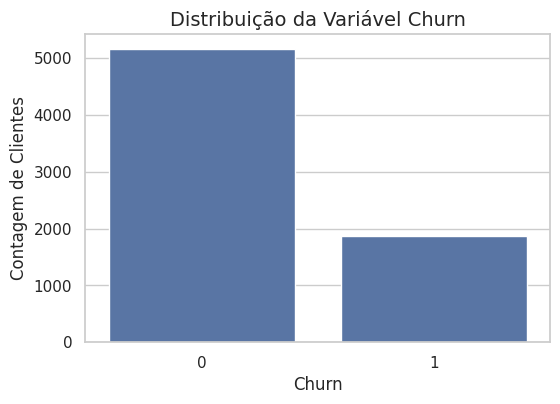
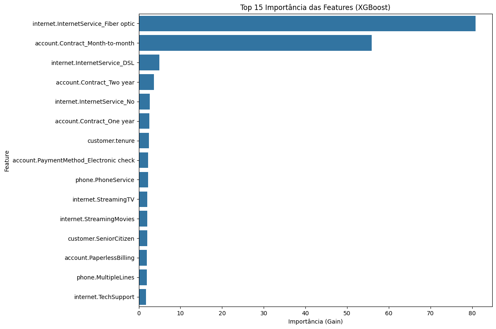

# Análise Preditiva de Evasão de Clientes (Churn) em Telecom

## 📖 Sobre o Projeto
Este repositório contém o projeto desenvolvido como parte do programa de formação em Data Science oferecido pela Oracle em parceria com a Alura. O objetivo principal é realizar uma análise completa sobre a evasão (churn) de clientes em uma empresa de telecomunicações, desenvolvendo um modelo de Machine Learning capaz de prever quais clientes têm maior probabilidade de cancelar seus serviços.

Além da modelagem preditiva, o projeto foca em identificar os fatores mais influentes na decisão de churn, traduzindo os resultados técnicos em insights acionáveis e estratégias de negócio para a retenção de clientes.

## 🛠️ Tecnologias e Bibliotecas
O projeto foi desenvolvido em Python no ambiente Google Colab e utiliza as seguintes bibliotecas principais:

- **pandas**: Para manipulação e análise de dados estruturados.
- **scikit-learn**: Para pré-processamento de dados, modelagem e avaliação de métricas.
- **imblearn**: Para aplicar técnicas de balanceamento de dados, como o SMOTE.
- **xgboost**: Para treinar o modelo Gradient Boosting e extrair a importância das variáveis.
- **matplotlib & seaborn**: Para a criação de visualizações gráficas e estatísticas.
- **requests & json**: Para extrair e manipular os dados brutos no formato JSON.

## 🔬 Metodologia de Modelagem
A abordagem para a construção do modelo preditivo foi sistemática e comparativa, garantindo a escolha da solução mais eficaz para o problema de negócio.

### 1. Desafio: Dados Desbalanceados
A análise exploratória inicial revelou um forte desbalanceamento na variável alvo, com uma proporção muito maior de clientes não-evasivos. Para mitigar o risco de um modelo enviesado e com baixa capacidade de prever a classe minoritária (Churn), foi utilizada a técnica de oversampling SMOTE (Synthetic Minority Over-sampling Technique).

### 2. Modelos Avaliados
Foram treinados e avaliados três algoritmos de classificação distintos, tanto nos dados originais quanto nos dados balanceados pelo SMOTE, para uma comparação robusta:

- **Regressão Logística**: Um modelo linear robusto e altamente interpretável.
- **Random Forest**: Um modelo baseado em árvores de decisão, eficaz para capturar interações complexas.
- **XGBoost**: Um modelo de Gradient Boosting conhecido por sua alta performance e precisão.

### 3. Métrica de Sucesso
Dado o contexto de negócio, onde o custo de não identificar um cliente que irá evadir (falso negativo) é alto, a métrica prioritária para avaliação foi o **Recall**.

## 🚀 Desempenho e Resultados
Após a fase de treinamento, os modelos foram avaliados no conjunto de teste. A tabela abaixo resume o desempenho comparativo:

### Comparativo de Desempenho

| Modelo                          | Recall | Precisão | F1-Score | ROC AUC |
|---------------------------------|--------|----------|----------|---------|
| Regressão Logística (Original)  | 0.55   | 0.65     | 0.60     | 0.84    |
| Random Forest (Original)        | 0.49   | 0.65     | 0.56     | 0.82    |
| XGBoost (Original)              | 0.52   | 0.68     | 0.59     | 0.84    |
| Regressão Logística (SMOTE)     | **0.79** | 0.51     | 0.62     | 0.84    |

### Conclusão da Análise de Modelos
Os modelos treinados nos dados originais apresentaram um Recall baixo, sendo incapazes de identificar cerca de metade dos clientes que de fato cancelaram o serviço. A aplicação da técnica de balanceamento SMOTE no modelo de Regressão Logística resultou em um aumento drástico do Recall para **79%**. Embora isso tenha diminuído a Precisão, o ganho na capacidade de identificar clientes em risco justifica a troca, alinhando o desempenho do modelo ao objetivo principal do negócio.

A **Regressão Logística treinada com dados balanceados pelo SMOTE** foi, portanto, selecionada como a solução final.

## 📊 Principais Gráficos e Observações
Para ilustrar os resultados da análise, os seguintes gráficos extraídos do notebook são essenciais:

### 1. Desbalanceamento da Variável Alvo
Gráfico de barras mostrando a contagem de clientes "Churn: Sim" vs. "Churn: Não".  

**Observação**: O gráfico evidencia a necessidade de técnicas de balanceamento de dados para garantir que o modelo aprenda a identificar corretamente a classe minoritária (churn).

### 2. Importância das Variáveis (Feature Importance)
Gráfico de barras horizontais mostrando as 10 variáveis mais importantes segundo o modelo XGBoost.  
 

**Observação**: A análise de importância revela que o tipo de contrato mensal, o baixo tempo de permanência (tenure) e o serviço de internet fibra óptica são os fatores mais decisivos para prever a evasão de um cliente. Esta informação é crucial para direcionar as estratégias de retenção.

## 💡 Estratégias de Retenção Propostas
Com base nos resultados, foram propostas quatro estratégias principais:

1. **Fidelização através de Contratos de Longo Prazo**: Incentivar a migração de clientes do plano mensal para planos anuais/bianuais.  
2. **Programa de Acolhimento para Novos Clientes**: Acompanhamento focado nos primeiros meses para garantir uma boa experiência.  
3. **Auditoria do Serviço de Fibra Óptica**: Investigar e corrigir possíveis problemas de preço, qualidade ou suporte relacionados a este serviço.  
4. **Venda de Valor Agregado**: Incentivar a contratação de serviços adicionais de segurança e suporte técnico para aumentar o engajamento.  
